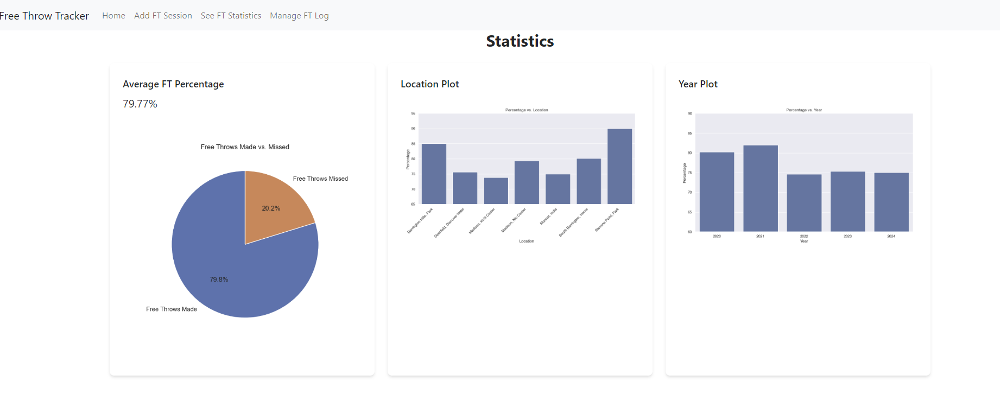

# Free Throw Tracker

An application that allows me to track my free throw percentage.

## Table of Contents

1. [About](#about)
2. [Usage](#usage)
3. [Pages](#pages)

## About

In high school, I played basketball and after every single practice our coach would have us shoot free throws and record how many we made out of 10 to our team manager and she would record it in excel. Then over time our coach would see how we shoot free throws as a team and individually over time. This inspired me to make my own program in Java which I had just recently learned at the time. Now fast forward to the end of college and I remade the free throw tracker using Flask.

## Usage

The project has three components.
1) Adding Free Throw Data
2) Managing Free Throw Data Log
3) Statistics Dashboard

## Pages

The add page allows me as the user to add free throw sessions into the database so I can track the trend in my shooting.

The log page shows all the data that is in the sqlite database. Here, the user can edit or delete a specific shooting session if they incorrectly inputed data into the database. A visually appealing error handling log. 

The statistics page provides insights on my free throw shooting through data visualizations.

